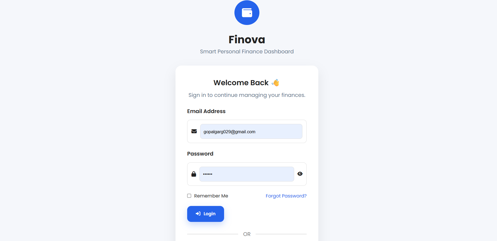
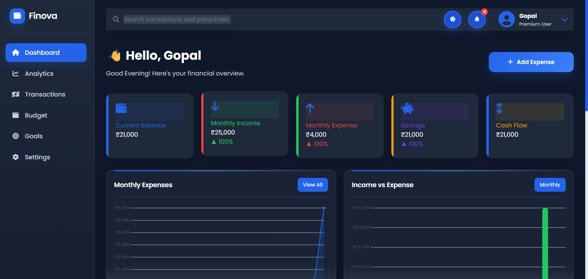
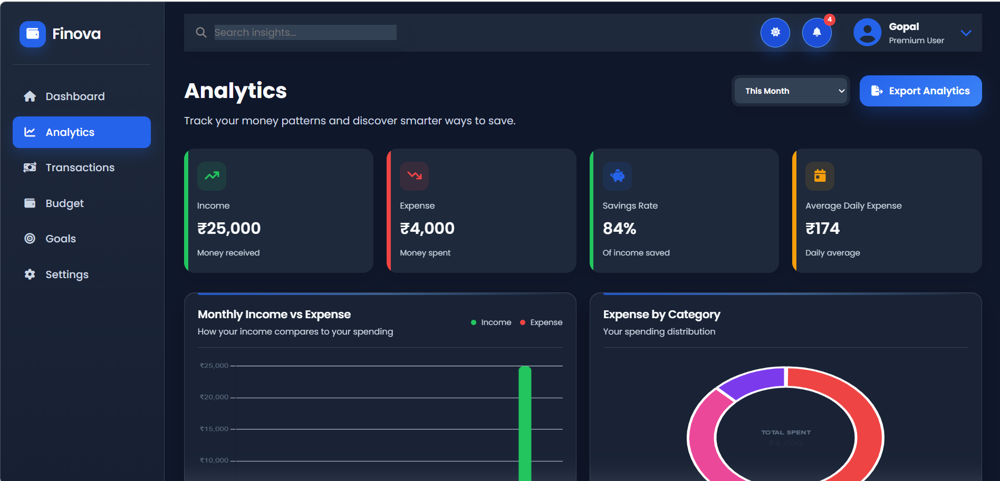
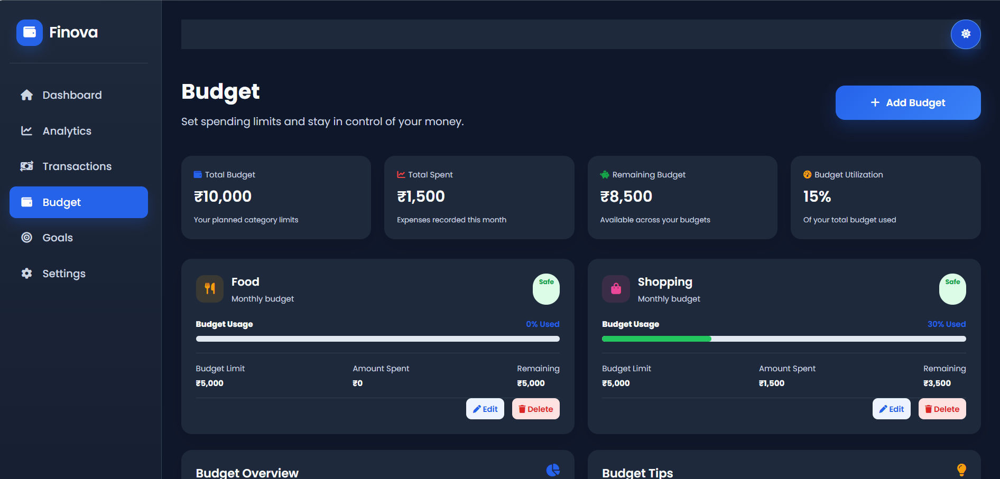
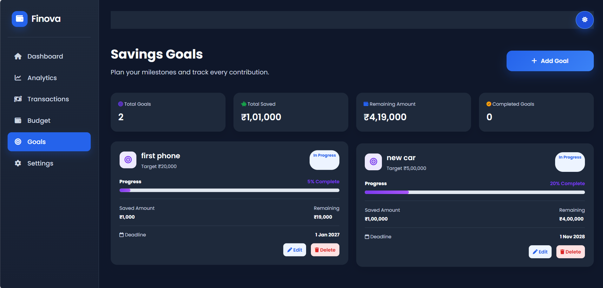
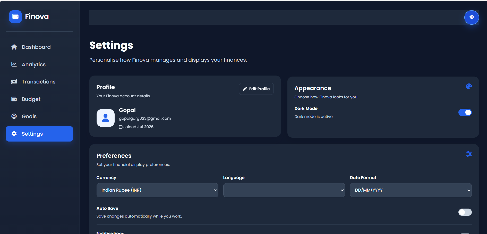

# Finova - Personal Finance Dashboard

> A modern personal finance dashboard for tracking income, expenses, budgets, and savings goals from one focused workspace.


Finova is a polished, client-side financial management application that makes everyday money tracking approachable. It brings transactions, budgeting, goals, reporting, and visual insights together in a responsive interface designed for clarity and fast decision-making.

## 💼 Project Overview

Finova helps individuals build a clear view of their financial activity without requiring a complex spreadsheet or external service. It is designed for students, professionals, freelancers, and anyone who wants a simple way to manage personal income, expenses, budgets, and savings targets.

The application stores financial data locally per signed-in user, allowing users to return to their own records after logging in again. Interactive charts and concise summaries turn raw transaction data into useful insights, while the PDF report export makes financial information easy to share or retain.

Key highlights include account-aware local data storage, an interactive dashboard, category-level spending analysis, budget controls, savings-goal tracking, dark mode, and a modern fintech-inspired interface.

## ✨ Features

### Authentication

- Register a new Finova account and sign in with saved credentials.
- Maintain a separate session and financial data set for each user.
- Support remembered email addresses and password update controls.

### Dashboard

- Review balance, monthly income, expenses, savings, and cash flow at a glance.
- Explore recent transactions, budget progress, and practical finance insights.
- Add an expense directly from the primary dashboard action.

### Transactions

- Add, edit, view, delete, search, filter, sort, and paginate transactions.
- Track income and expenses with categories, payment methods, status, dates, and notes.
- Export filtered transaction data as CSV.

### Analytics

- Compare monthly income and expenses.
- Visualize spending by category in a circular doughnut chart.
- Track cash flow, income sources, daily expense activity, and savings patterns.
- Filter analytics by time period and export analytics data.

### Budget Management

- Create category-based spending limits.
- Monitor total budgets, spending, remaining amounts, and utilization.
- Receive clear visual feedback for safe, warning, and exceeded budget states.

### Savings Goals

- Create personalized savings targets with saved amounts, deadlines, and icons.
- Track goal progress, completion status, remaining amount, and target milestones.

### Settings

- Manage profile details, currency, language, date format, preferences, and theme.
- Import JSON backups and reset finance data without removing account details.

### Charts

- Use Chart.js for responsive bar, line, and doughnut visualizations.
- Present financial trends in a clear, interactive format.

### Responsive Design

- Adapt layouts, navigation, cards, tables, and controls for desktop, tablet, and mobile screens.

### Dark Mode

- Switch between light and dark themes with a persistent visual preference.

### Local Storage

- Persist user sessions, transactions, budgets, goals, preferences, and finance data in the browser.
- Keep core financial records scoped to the signed-in user.

### Modern UI

- Deliver a clean fintech interface with accessible controls, clear hierarchy, responsive cards, and Font Awesome icons.

## 🧰 Tech Stack

| Technology | Purpose |
| --- | --- |
| HTML5 | Semantic page structure and application screens |
| CSS3 | Responsive layouts, themes, components, and visual styling |
| JavaScript (ES6) | Application logic, state handling, user interaction, and data processing |
| Chart.js | Interactive financial charts and visual analytics |
| LocalStorage | Client-side persistence for sessions, preferences, and user finance data |
| Font Awesome | Interface and navigation icons |

## 📁 Project Structure

```text
Expense-Tracker-App/
├── Assets/
│   ├── analytics.png
│   ├── budget.png
│   ├── dashboard.png
│   ├── dashboard(2).png
│   ├── dashboard(3).png
│   ├── goals.png
│   └── settings.png
├── pages/
│   ├── analytics.html
│   ├── budget.html
│   ├── dashboard.html
│   ├── goals.html
│   ├── settings.html
│   └── transactions.html
├── scripts/
│   ├── analytics.js
│   ├── app.js
│   ├── auth.js
│   ├── budget.js
│   ├── charts.js
│   ├── dashboard.js
│   ├── goals.js
│   ├── localStorage.js
│   ├── settings.js
│   ├── transactions.js
│   └── utils.js
├── styles/
│   ├── analytics.css
│   ├── budget.css
│   ├── dashboard.css
│   ├── goals.css
│   ├── settings.css
│   └── transactions.css
├── index.html
├── style.css
└── README.md
```

## 📸 Screenshots

### Login



### Dashboard



### Transactions


### Analytics



### Budget



### Savings Goals



### Settings



## 🚀 Getting Started

### Clone the repository

### Open the project

Open the project folder in your preferred editor, such as Visual Studio Code.
### Run locally

Because Finova is a client-side application, no package installation or backend server is required. Open `index.html` in a modern browser, or launch it with the Live Server extension in Visual Studio Code for a smoother local development experience.

## 🧭 How to Use

1. **Register** - Create a new account from the sign-up form. New accounts begin with empty budgets and goals.
2. **Login** - Sign in to access your personal finance workspace and previously saved records.
3. **Add Transactions** - Use **Add Expense** or the transactions page to record income and expenses with details such as category, date, method, and notes.
4. **Create Budgets** - Set category limits and monitor current-month progress.
5. **Create Goals** - Add savings targets, saved amounts, and deadlines to track long-term milestones.
6. **View Analytics** - Explore monthly trends, category spending, income sources, and cash flow.
7. **Export Reports** - Go to Settings and select **Export PDF Report** to download a structured financial report.
8. **Manage Settings** - Update your profile, display preferences, theme, or backup data controls.

## 🌟 Project Highlights

- **Modern fintech UI** - A polished dark-first visual system with clear information hierarchy and purposeful status colors.
- **Interactive dashboard** - Consolidates key financial metrics, trends, recent activity, and actionable insights.
- **Charts that inform** - Uses Chart.js to make category spending, income-versus-expense comparisons, cash flow, and trends immediately understandable.
- **Responsive design** - Maintains usability across desktop, tablet, and mobile breakpoints.
- **Modular architecture** - Separates page templates, page-specific styles, application modules, storage utilities, and chart logic.
- **Clean code** - Uses reusable helpers, structured data handling, and focused JavaScript modules for maintainability.

## 🔮 Future Improvements

- Cloud synchronization across devices.
- Backend integration with a secure REST or GraphQL API.
- Production authentication API with secure password hashing and account recovery.
- Database support for durable, scalable financial records.
- Scheduled monthly PDF and email reports.
- Configurable budget alerts and in-app notifications.
- AI-powered spending insights and personalized saving suggestions.
- Multi-currency exchange-rate support and advanced recurring-transaction management.

## 📄 License

This project is licensed under the [MIT License](LICENSE).

## 👤 Author

**Developer Name:** Gopal Garg 
**GitHub:** (https://github.com/gopalgarg20)  
**LinkedIn:** (https://www.linkedin.com/in/gopalgarg20/)  
**Email:** gopalgarg029@gmail.com

